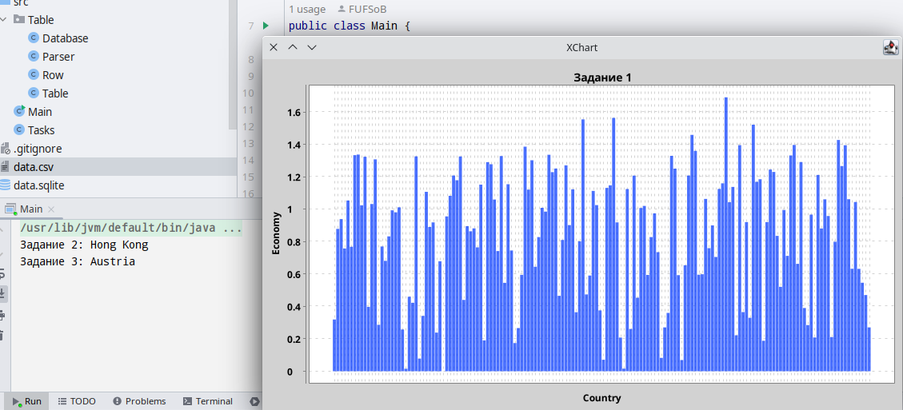

# Итоговый проект по курсу "Java. Основы программирования на РТФ."

## Информация о проекте

- Вариант 1
- Используемые maven модули:
  - `com.opencsv:opencsv:5.7.1` - модуль для упрощённого парсинга csv файлов
  - `org.xerial:sqlite-jdbc:3.40.0.0` - модуль для работы с базой данных SQLite
  - `org.knowm.xchart:xchart:3.6.5` - модуль для построения графиков

## Ход работы

В первую очередь необходимо написать класс для парсинга csv-таблицы
и сохранения результата в качестве базы данных SQLite. Для этого
было решено использовать модули `opencsv` и `sqlite-jdbc`.

Поскольку мне не нравится писать классы сугубо для одной задачи, я
решил сделать все классы в модуле `Table` универсальными
и легко расширяемыми.

Все SQL команды для создания бд в модуле `Table` генерируются
в зависимости от исходной таблицы. Все типы для столбцов также
определяются автоматически.

Названия столбцов в базе данных генерируются по следующим правилам:
используется camelCase, пробелы игнорируются, все символы после
любого не-буквенно-числового символа игнорируются. Например:
- `Happiness Score` -> `happinessScore`
- `Health (Life Expectancy)` -> `health`

После написания модуля `Table` я написал главную функцию `main` в
модуле `Main`, чтобы проверить его работоспособность.

[Коммит](https://github.com/FUFSoB/urfu-java-project/commit/45fb24d9e75035b349341187283f45e52e7ee484)

Далее уже было необходимо делать сами задания. Для этого я создал
класс `Tasks`, в котором будут реализованы все три задачи.

В классе `Table.Database` был реализован дополнительный метод
для обработки запросов, возвращающий все необходимые результаты.

В первом задании для построения графика я решил использовать
модуль `xchart`, так как он мне показался более простым, чем
`jfreechart`.

Тут вызывает вопросы формулировка
"объеденив их по странам". Я просто составил график, в котором
все страны представлены как отдельные столбцы, на которые можно
навестись и получить информацию о стране. Они отсортированы в
алфавитном порядке.

На графике отсутствуют легенда и значения по оси X, поскольку
они не несут никакой полезной информации в таком плотном графике.

Второе задание не вызвало никаких проблем.

В третьем задании в расчёт "самых средних показателей" я включил
только столбцы `economy`, `family`, `health`, `freedom`, `trust`,
`generosity`. Все прочие столбцы, как мне показалось, являются
производными или дополнительными, и их не стоит включать в расчёт.

[Коммит](https://github.com/FUFSoB/urfu-java-project/commit/60c450695ec25cd553b7ef4cee813fef8754224d)

## Ответы на задания

### Задание 1:

«Сформируйте график по показателю экономики объеденив их по странам»

- график на скриншоте выше

### Задание 2:

«Выведите в консоль страну с самым высоким показателем экономики среди
"Latin America and Caribbean" и "Eastern Asia"»

- Hong Kong

### Задание 3:

«Найдите страну с "самыми средними показателями" среди
"Western Europe" и "North America"»

- Austria
